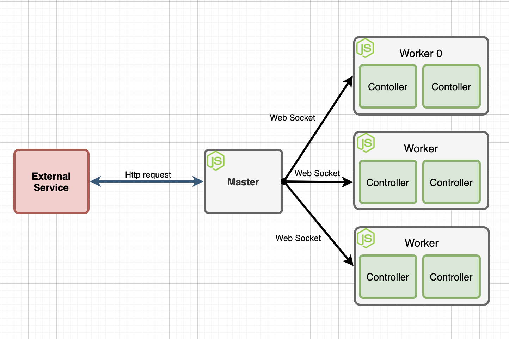

# Jiji Cluster Network

Simple cluster network Node.js implementation using Master & Worker architecture

## Usage

This project can be used in situations where multiple servers are needed

## Requirements

* Node.js

## Install

Installation of master
```
cd cluster-master
npm install
```

Installation of worker

```
cd cluster-worker
npm install
```

## Run

### Master
```
node index.js --port 8080
```

### Worker
```
node index.js --port 9001 --password "abcdefg"
```

## Architecture



### Master

Master processes all external queries and manage all Workers.

Only one Master exists.

### Worker

Each Worker is a Controller

### Controller

The controller directly manages the process and reports the state to the master.

## Step
1. Workers open socket servers.
2. Master connects to Worker sockets.
3. Worker's initial state is 'invalid'.
5. When a client sends a request, Master saves them to a queue.
6. When Master finds a valid Worker, send a task.
7. When Worker receives a task, change state to 'invalid'. After Controller finishes the task, send result to Master and change state to 'valid'.
8. When Master receives a result from a Worker, send response to client.
